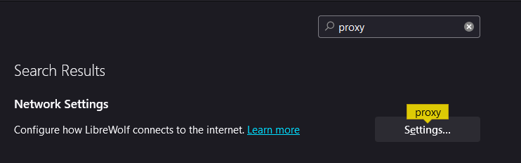
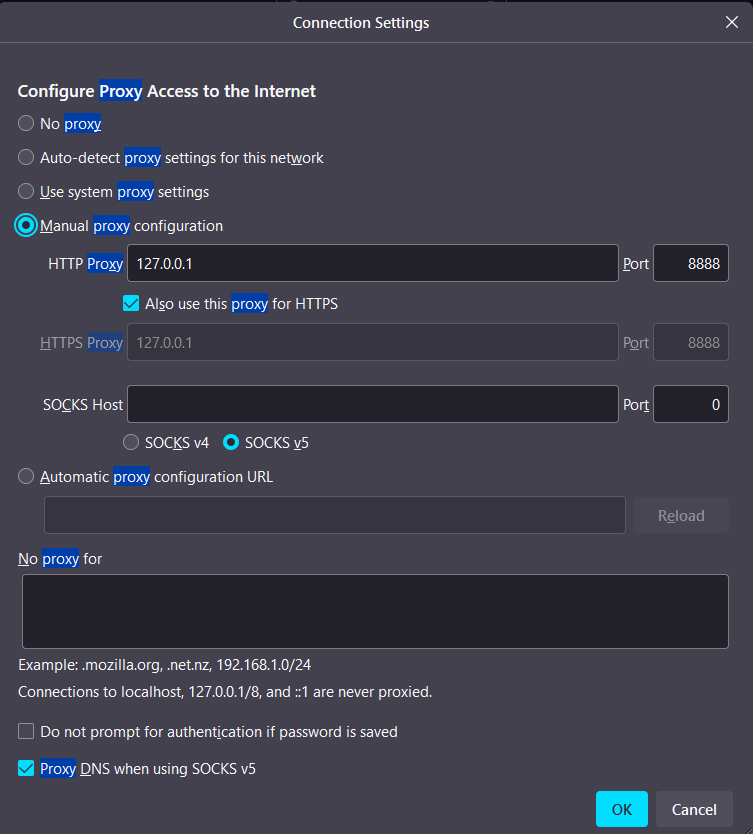

# :no_entry_sign: Ad-blocking Proxy Server
### A lightweight tool to block ad-related requests utilizing the Titanium.Web.Proxy library.

#### Features:
##### - Blocks ad-related requests at the proxy level.
##### -  Easily expandable with a custom list of domains or paths to block.
##### -  Console-based feedback for blocked requests.

#### Tasks on the project:
##### - Creating a proxy server - (completed);
##### - Filtering regular advertising, banners, scripts, etc - (50% completed);
##### - Filtering ads in YouTube videos - (uncompleted);
##### - Logging about errors and blocked advertisements - (completed);
##### - User-interface with starting and stopping the proxy server - (uncompleted);

#### Firstly, when you start it at the first time, you will need to agree this cetrificate to work with it adblocker:

#### I work with browser LibreWolf with built-in connection to a proxy server, as it is more convenient and efficient to test and work with it on small project, than start it from you pc system.
#### If you choise this solution with LibreWolf, you will need to open Settings and configure proxy-server connection:

#### After it you need to configure the confiration, and indicate the ip-adress and port on which you run the proxy server, in my example it is "127.0.0.1" and "8888":

### And after it confirms you can start to work with it, enjoy...